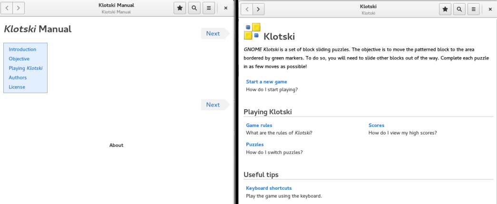
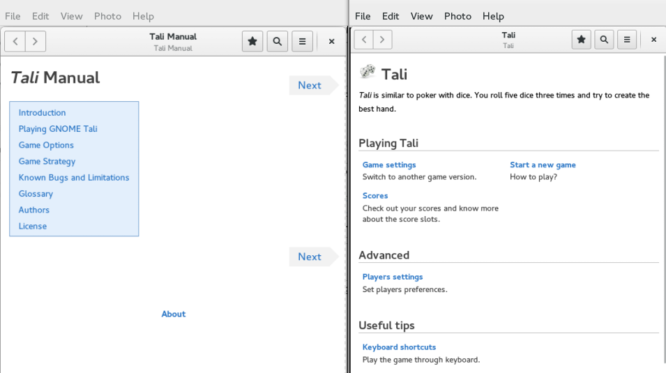
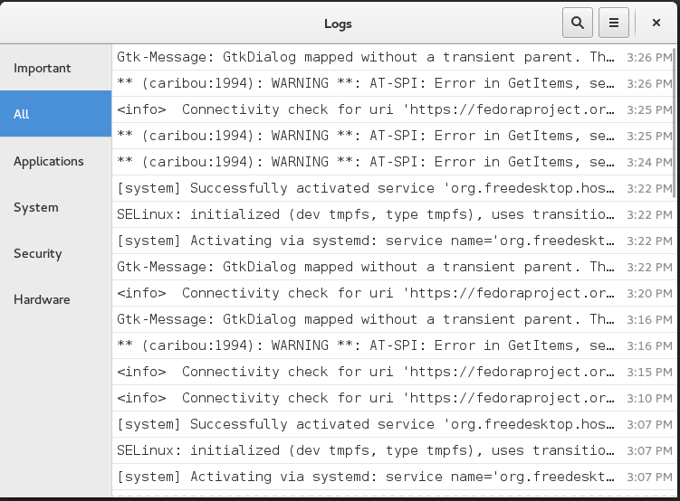

% Automated tests for Gnome-logs
% Rashi Aswani

---

\

---

<!-- Leave the alternative text empty and add a backslash *plus a trailing space
or an extra newline* to get no image caption at all -->

---

\

---

## GNOME Logs

 \

## Work done till now

<!-- Use > to make lists show incrementally. Oh you noticed?
     This is a comment! -->
 - Tests for the selection of an item in the sidebar menu.
 - Tests for the selection of the particular log listing for the respective selected item by creating a mock GLJournal API and writing a fake       message.
 - Tests for the “Go back” functionality when the log listing is selected.

